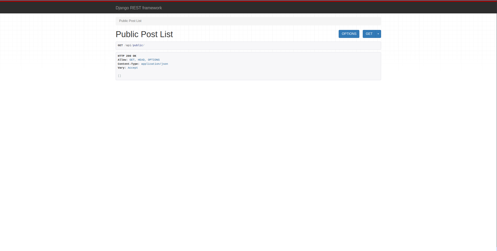

# Project README

## Setup Django REST Framework (DRF) API

### Step 1: Install Django REST Framework

Followed the instructions in the [DRF Quickstart](https://www.django-rest-framework.org/tutorial/quickstart/) to install Django REST Framework.

### Step 2: Update Django Settings

Added DRF to the `INSTALLED_APPS` in the `settings.py` file and updated the permission model.

```python
# settings.py
INSTALLED_APPS = [
    # ... other apps ...
    'rest_framework',
]

REST_FRAMEWORK = {
    'DEFAULT_PERMISSION_CLASSES': [
        'rest_framework.permissions.AllowAny',
    ],
}
```

### Step 3: Create Serializers

Created a `serializers.py` file with a serializer for the `Post` model.

```python
# serializers.py
from rest_framework import serializers
from blog import models

class PostSerializers(serializers.ModelSerializer):
    class Meta:
        model = models.Post
        fields = ("posted_by_id", "message")
```

### Step 4: Create API Views

Defined an API view in a separate file named `apiviews.py`.

```python
# apiviews.py
from rest_framework.views import APIView
from rest_framework.response import Response
from blog import models
from .serializers import PostSerializers

class PublicPostList(APIView):
    def get(self, request):
        msgs = models.Post.objects.public_posts()[:5]
        data = PostSerializers(msgs, many=True).data
        return Response(data)
```

### Step 5: Update URLs

Updated the `urls.py` file to include the path for the new API view.

```python
# urls.py
from django.urls import path
from .apiviews import PublicPostList

urlpatterns = [
    # ... other paths ...
    path("api/public", PublicPostList.as_view(), name="api_public"),
]
```

### Step 6: Verify API Endpoint

Ran the Django development server (`python manage.py runserver`) and visited [http://127.0.0.1:8000/api/public/](http://127.0.0.1:8000/api/public/) to ensure the API endpoint is working correctly.

### Step 7: Screenshots

- A screenshot of the API endpoint response in the browser.

## Screenshot(s)

### API Endpoint Response


